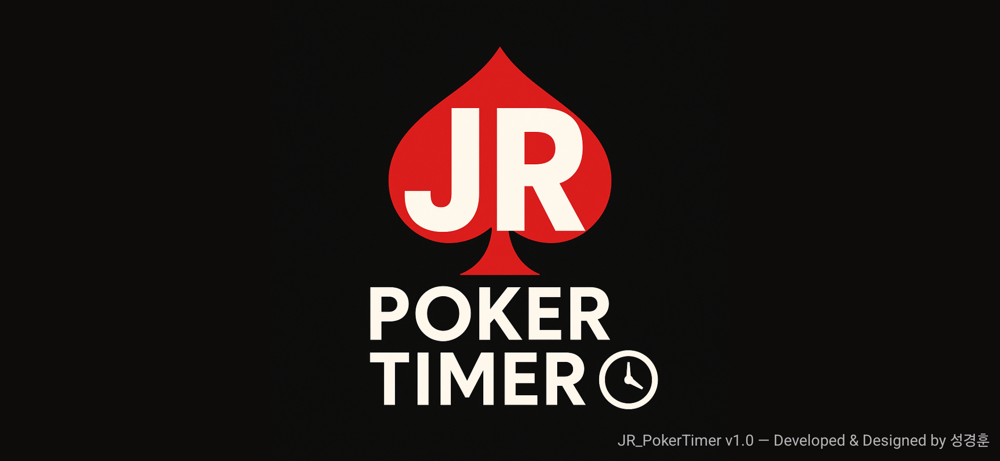
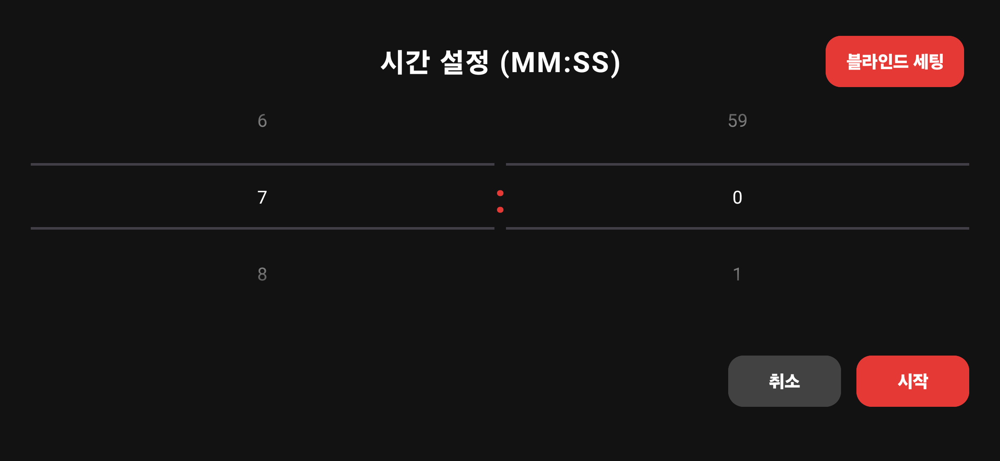
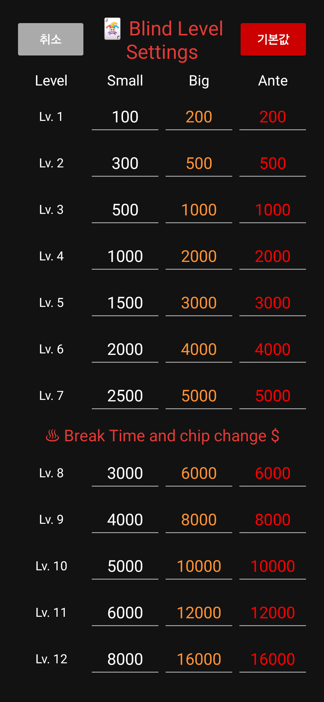
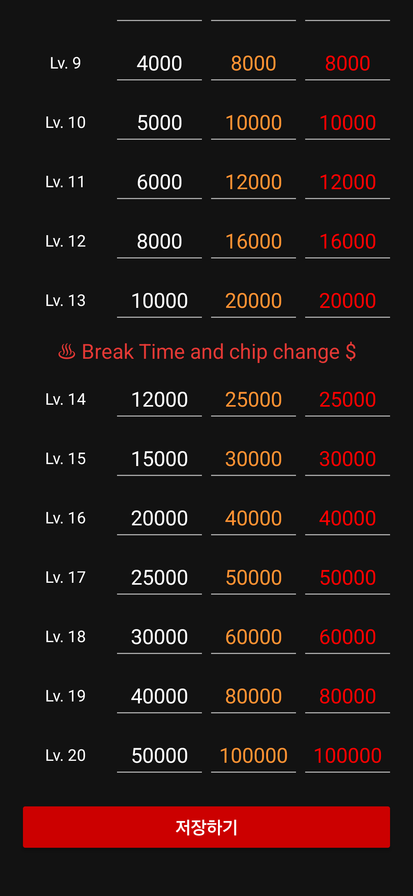
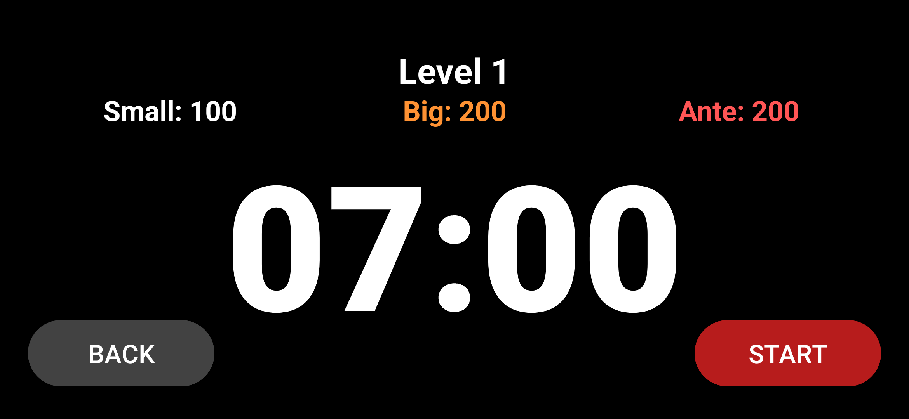
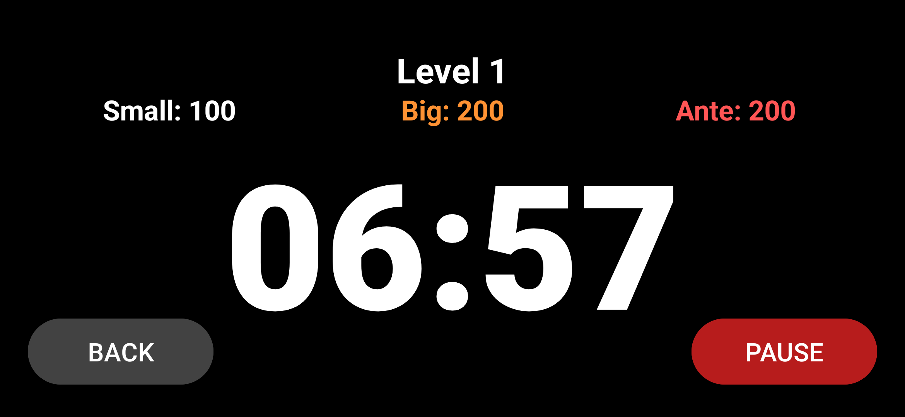
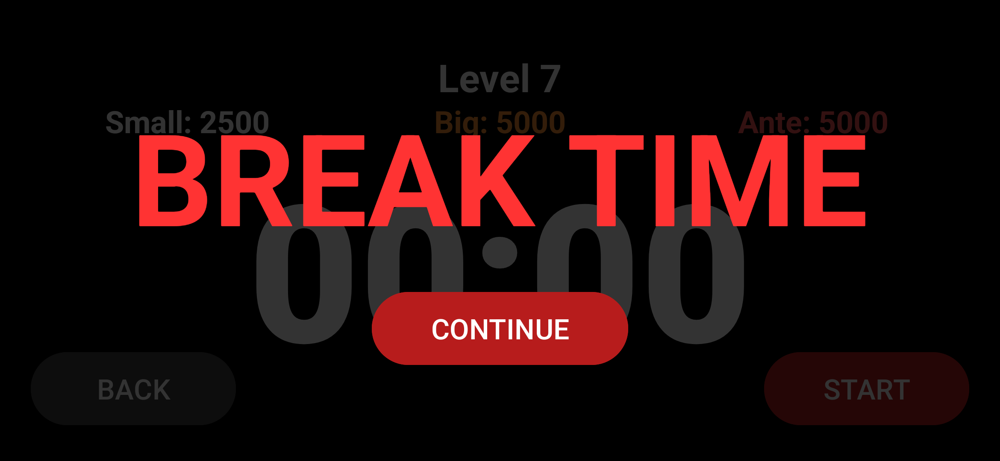

# 🎰 Poker Timer v1.0  
필요한 기능만 담아 더욱 깔끔하고 직관적인 **포커 타이머 앱**입니다.

포커 게임에서 중요한 **블라인드 구조**, **라운드 타이머**, **브레이크 타임** 기능만 넣어  
최대한 단순하고 빠르게 사용할 수 있도록 설계했습니다.

---

## 📌 주요 기능

- ✔ **BLIND 설정 가능**  
  라운드별 Small Blind / Big Blind 원하는 대로 설정

- ✔ **타이머 설정 가능**  
  라운드 시간, 총 시간, 브레이크 시간 모두 조정 가능

- ✔ **브레이크타임 2회 지원**  
  게임 흐름을 자연스럽게 유지하도록 중간 휴식 제공

- ✔ **불필요한 기능 제거 → 더 깔끔한 UI**

---

## 📱 화면 미리보기

### 🔹 시작 화면  

---

### 🔹 시간 설정  

---

### 🔹 블라인드 설정  

  
  

---

### 🔹 타이머 시작  
  

---

### 🔹 브레이크 타임  

---

## 📝 Version Info

**v1.0**

- BLIND 설정 기능
- 타이머 설정 기능
- 중간 브레이크 2회 제공
- UI 단순화 및 사용자 편의성 향상
- 모바일, 태블릿 화면 지원

---

## 👨‍💻 Developer  
**성경훈**

---

